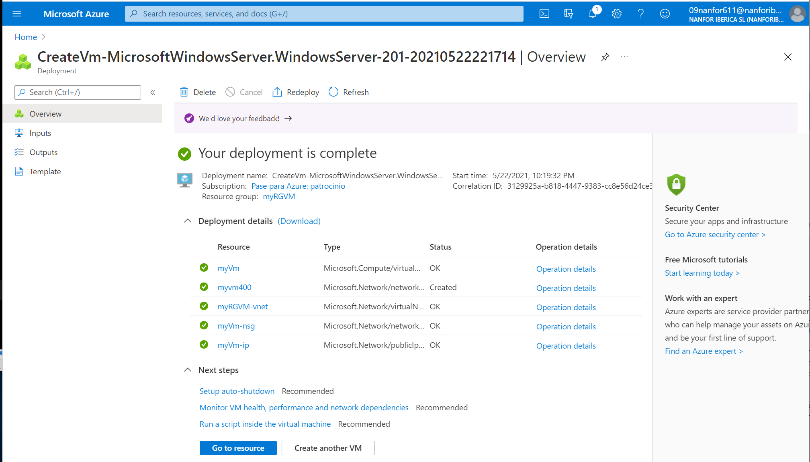
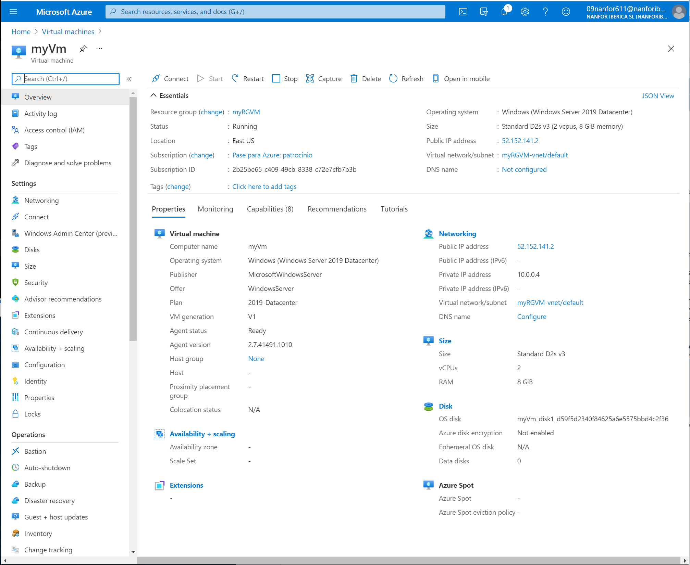
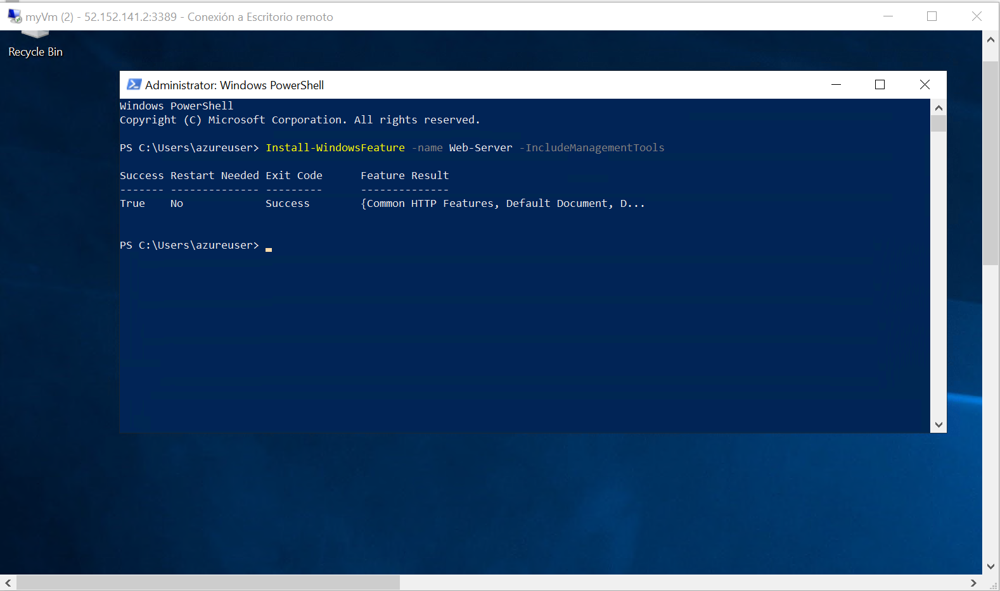
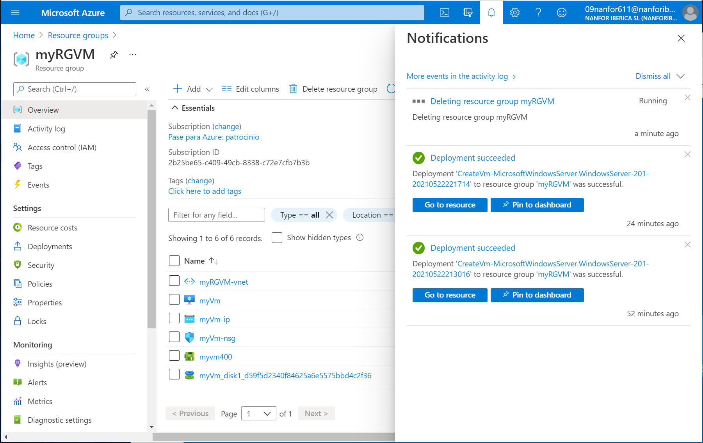

---

---

# 01 - Create a virtual machine in the portal

### Creación de la virtual machine

Creación de la virtual machine llamada **myVm**.

Vista de detalle de la virtual machine recien creada **myVm**. Con IP pública **52.152.141.2**

### Conexión mediante RDP a myVm y creación de un IIS web server

Conexión mediante RDP a la virtual machine en la IP 52.152.141.2 y creación de un IIS web server desde la PowerShell.

Conexión desde un browser al IIS

### Borrado de recursos

