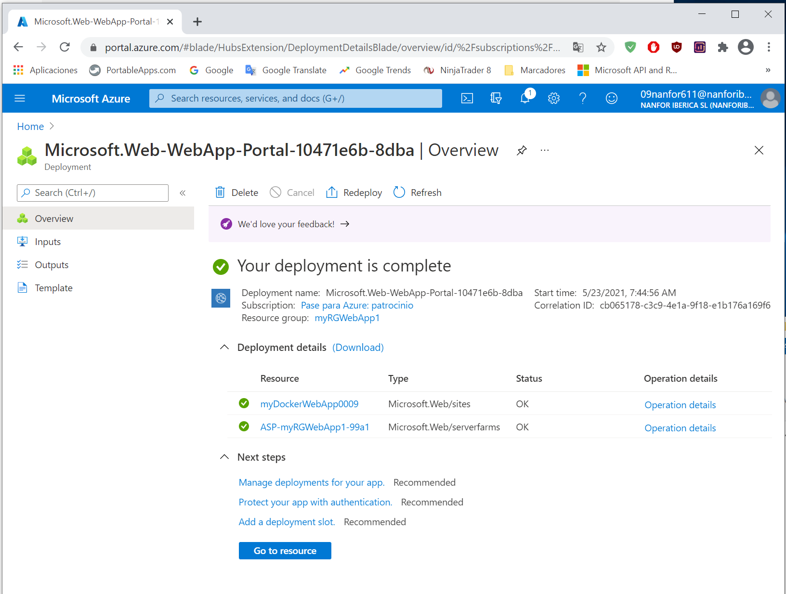
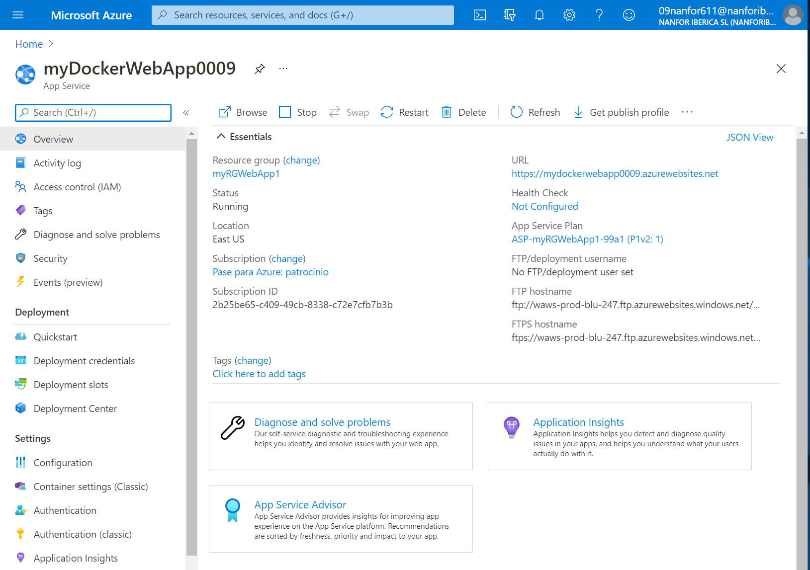
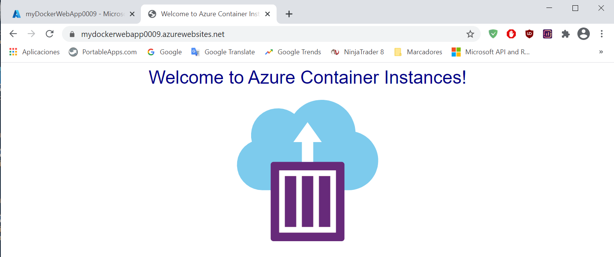
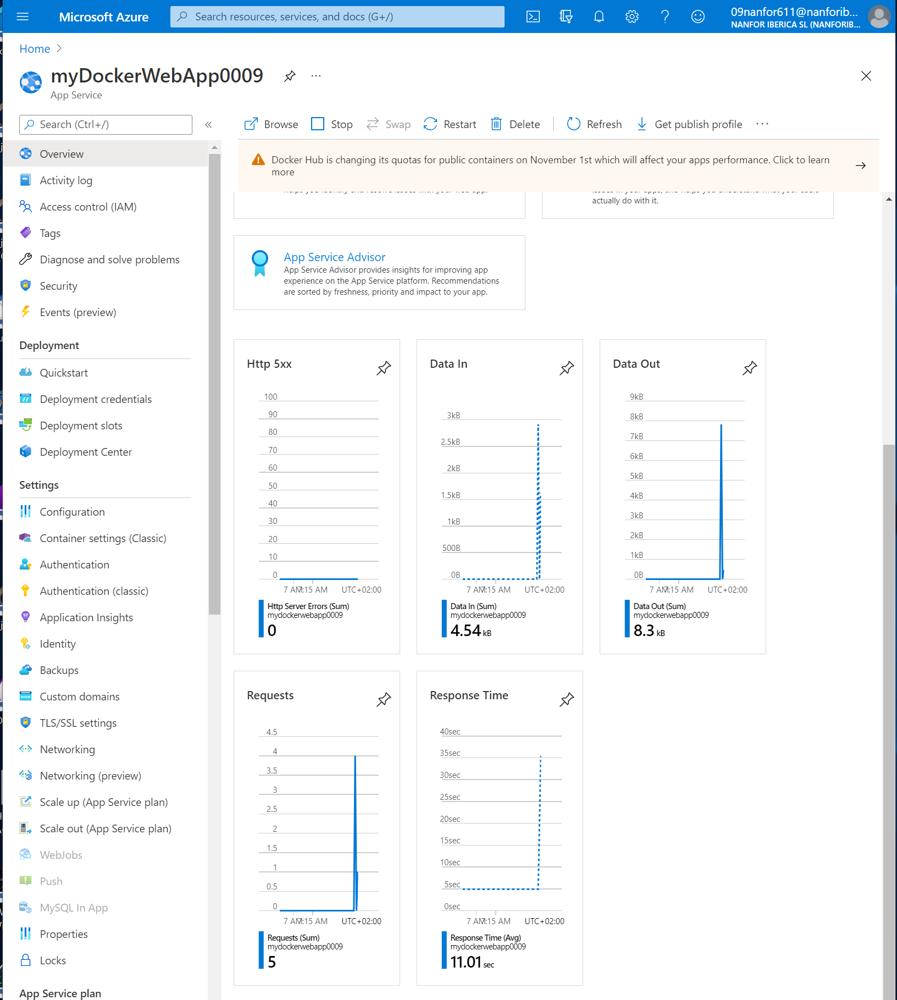
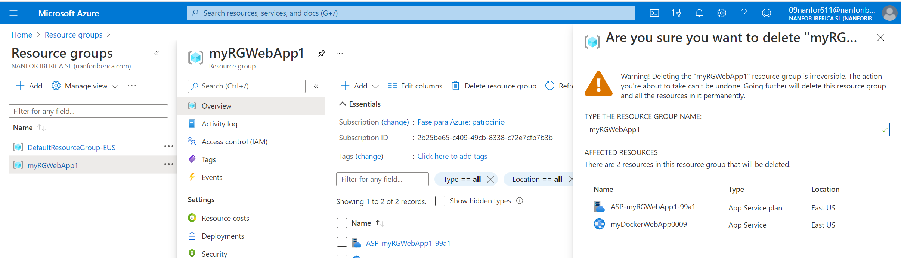

---

---
# 02 - Crear una aplicación web

Creación y configuración de una aplicación web en un contenedor Docker.

Recurso creado:

Request a la webapp desde un browser:

Datos iniciales de telemetría:

Datos de telemetría después de algunas peticiones:

Borrado de recursos:

