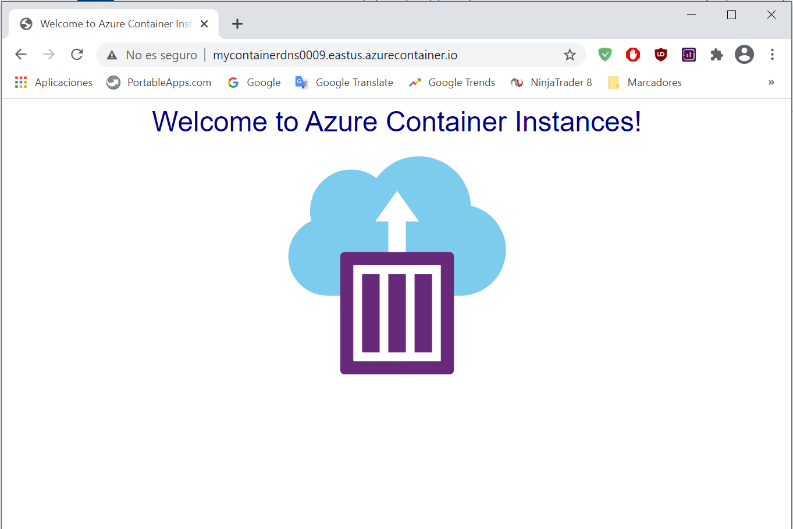

---
wts:
    title: '03 - Deploy Azure Container Instances (10 min)'
    module: 'Module 02 - Core Azure Services (Workloads)'
---

# 03 - Deploy Azure Container Instances

Creación de una instancia de Contenedor

Acceso al contenedor a través de su FQDN

Borrado de recursos

