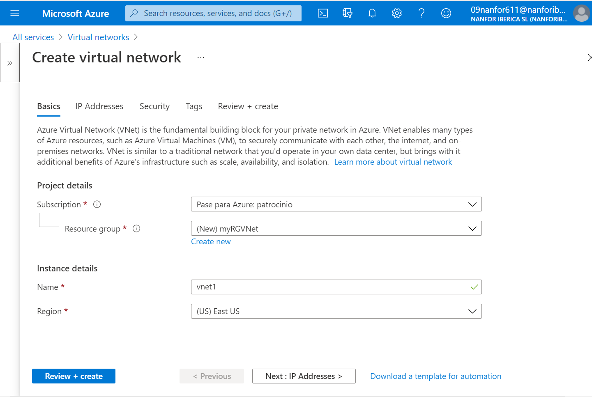
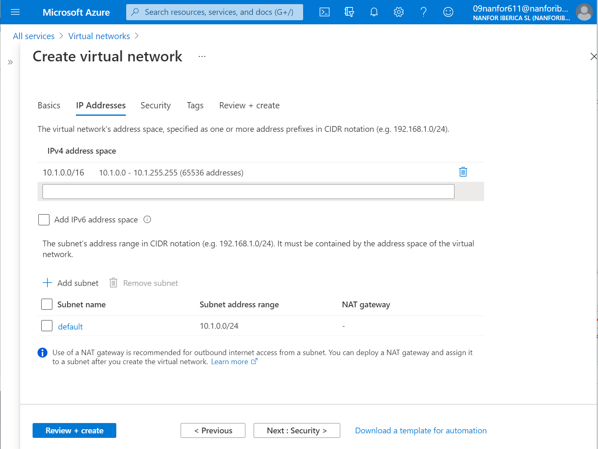
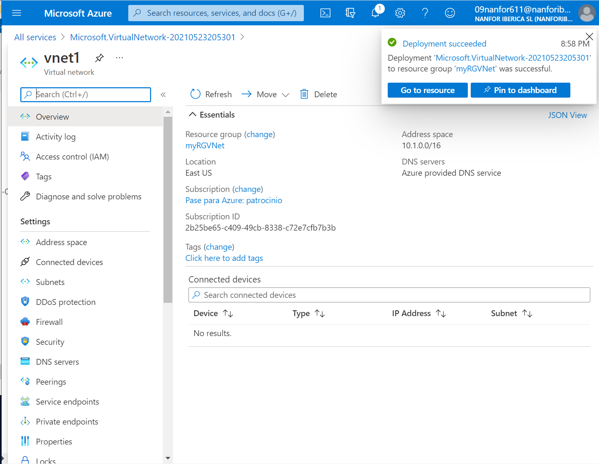
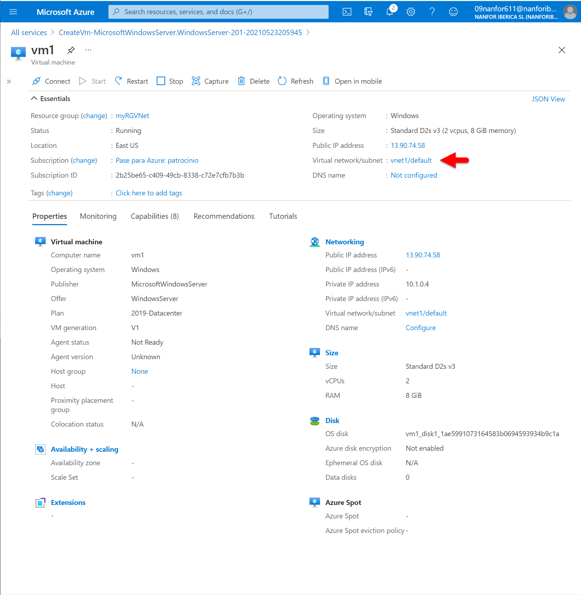
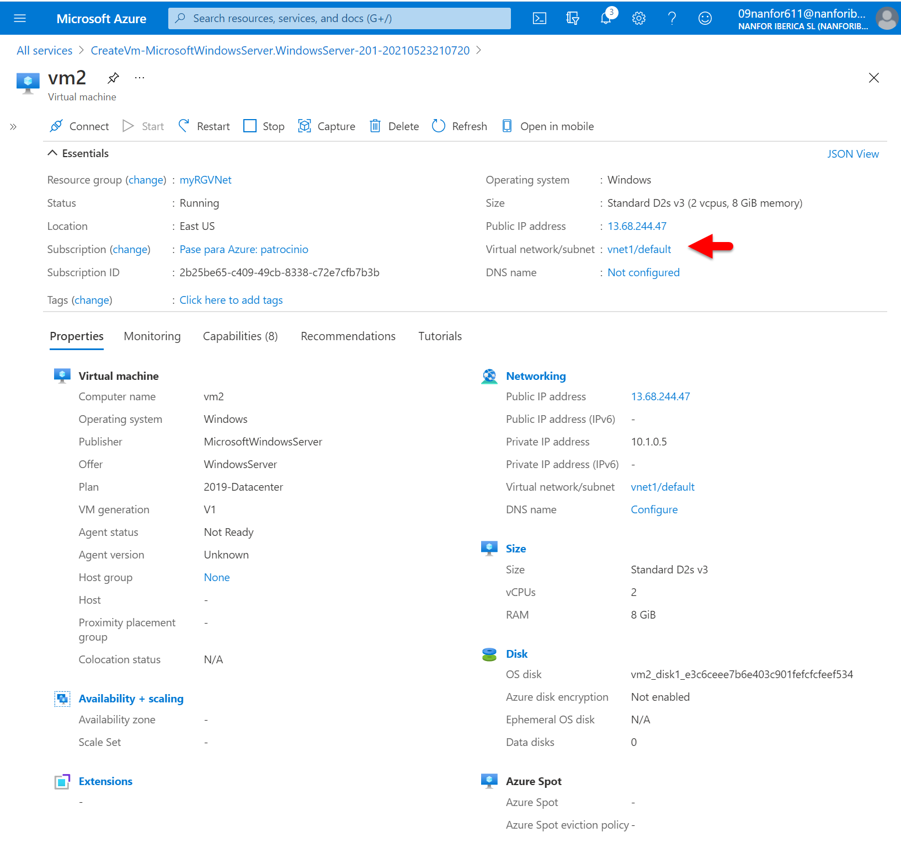
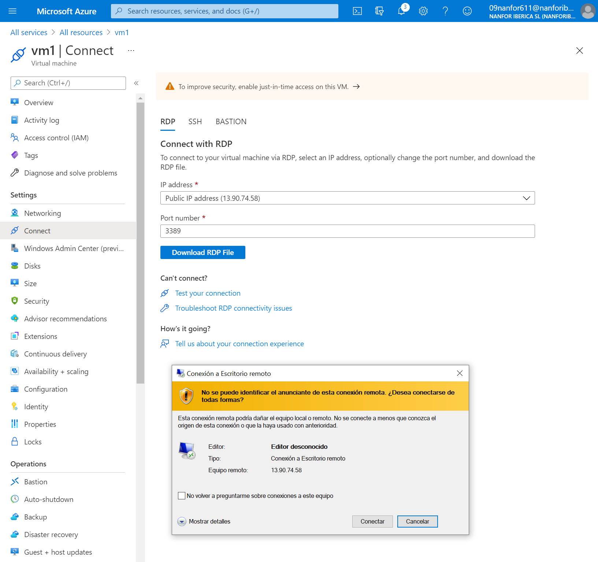
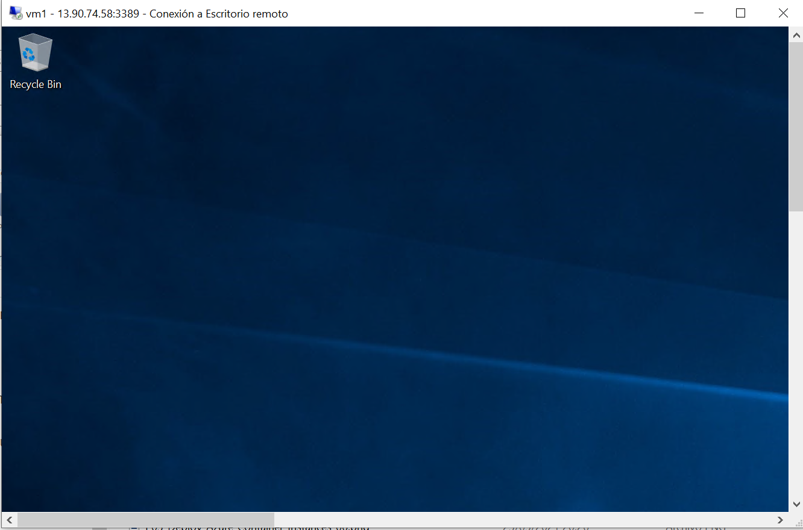
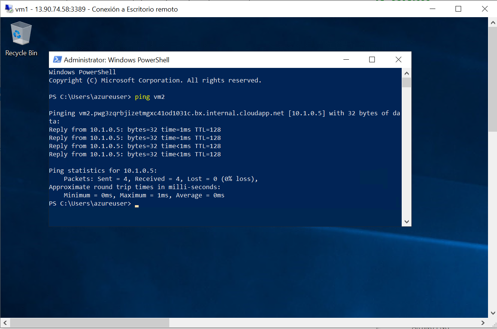

---
wts:
    title: '04 - Create a virtual network (20 min)'
    module: 'Module 02 - Core Azure Services (Workloads)'
---
# 04 - Create a virtual network

Creación de la red virtual **vnet1**:

Creación de la primera máquina virtual **vm1** dentro de la red virtual **vnet1**:

Creación de la segunda máquina virtual **vm2** dentro de la red virtual **vnet1**:

Conexión **RDP** a la primera máquina virtual **vm1**:

Dentro del escritorio de **vm1**:

Haciendo un ping de **vm1** a **vm2** desde la *PowerShell* en **vm1**:

