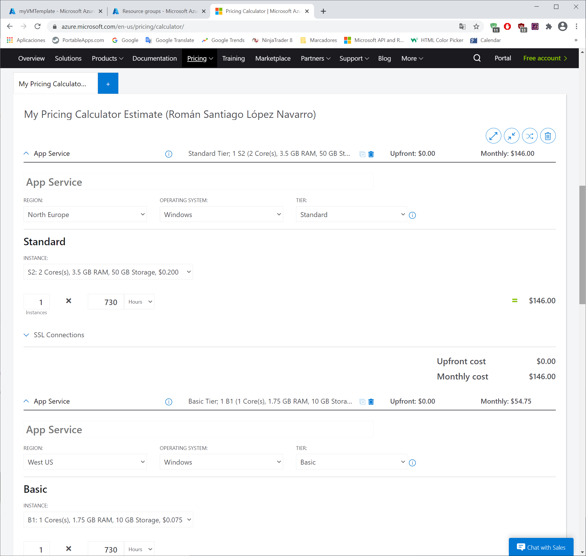
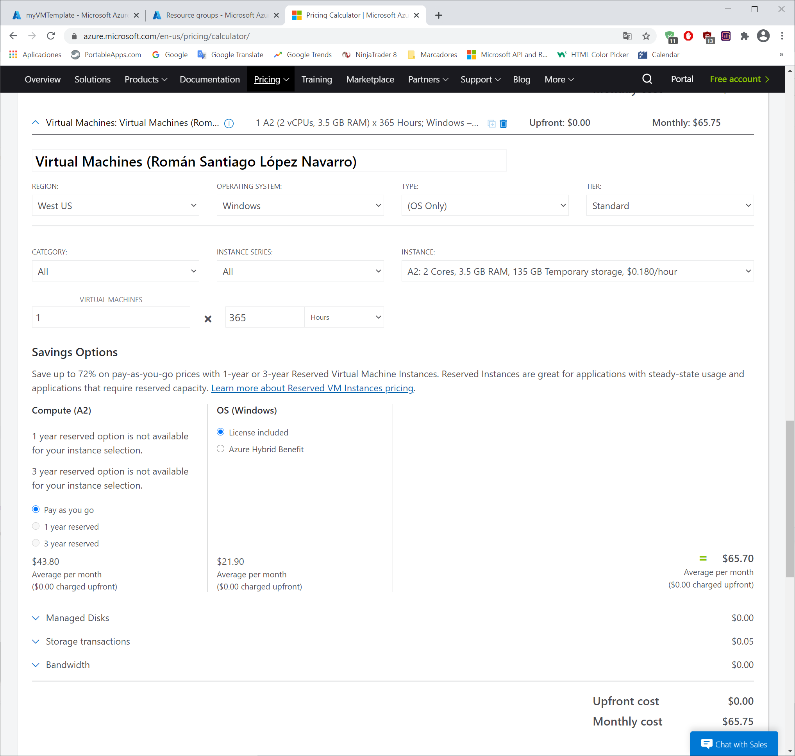
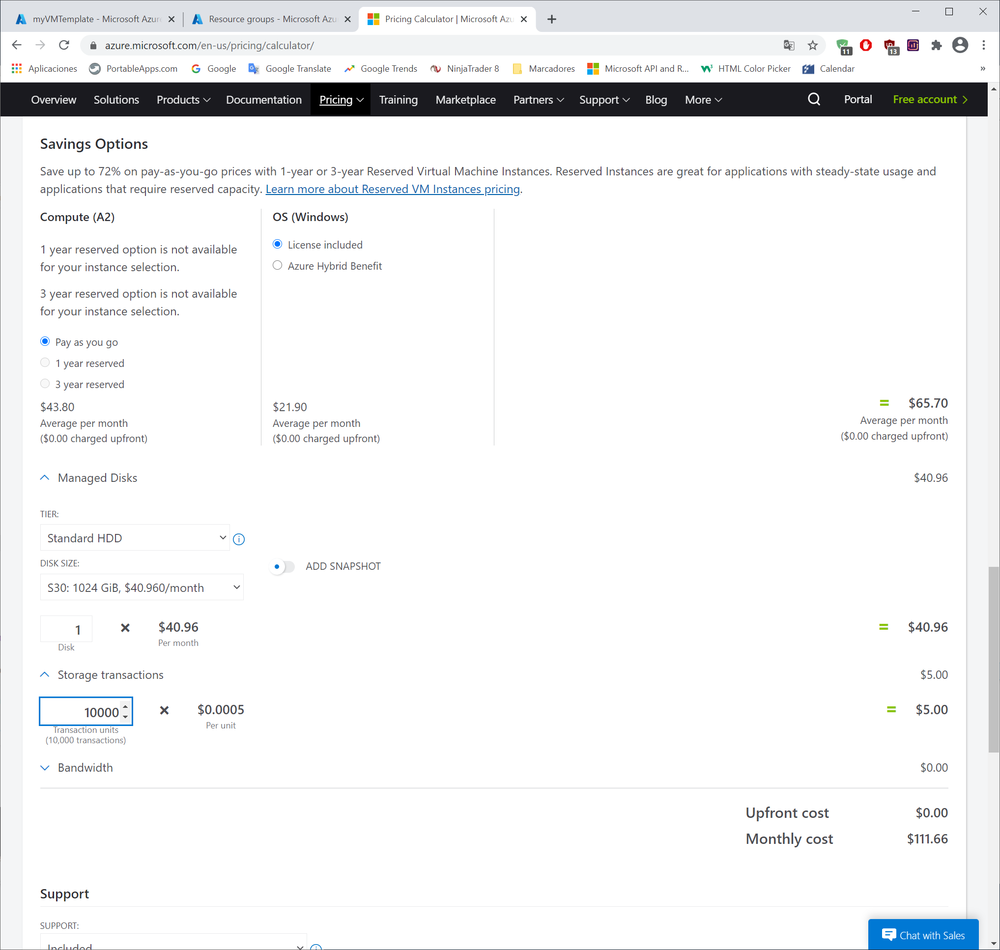
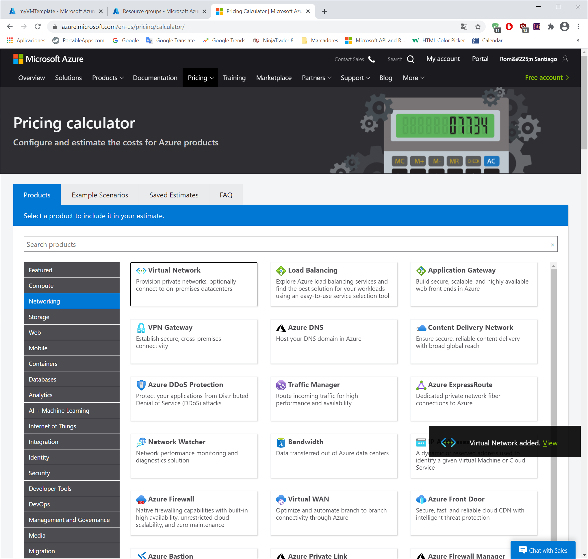
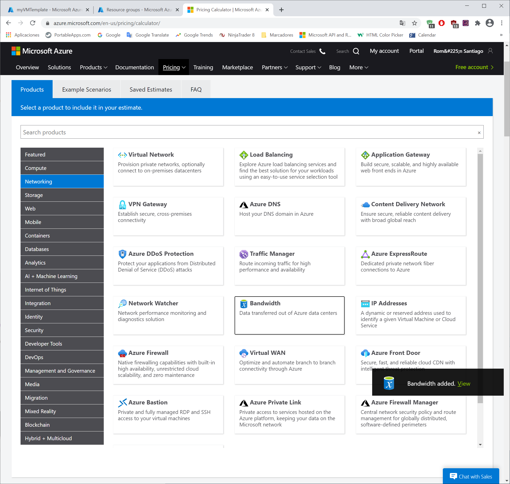
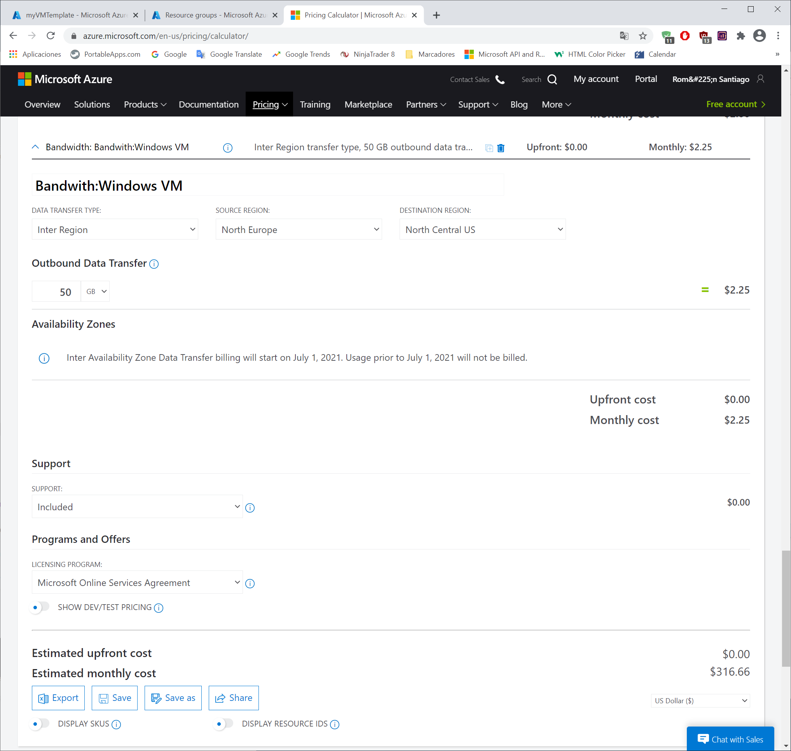
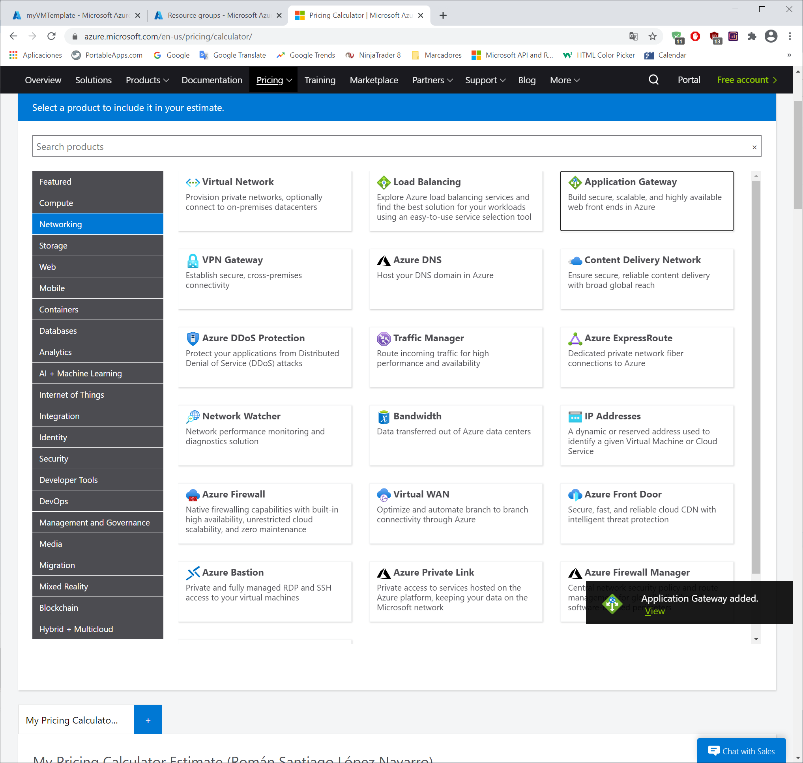
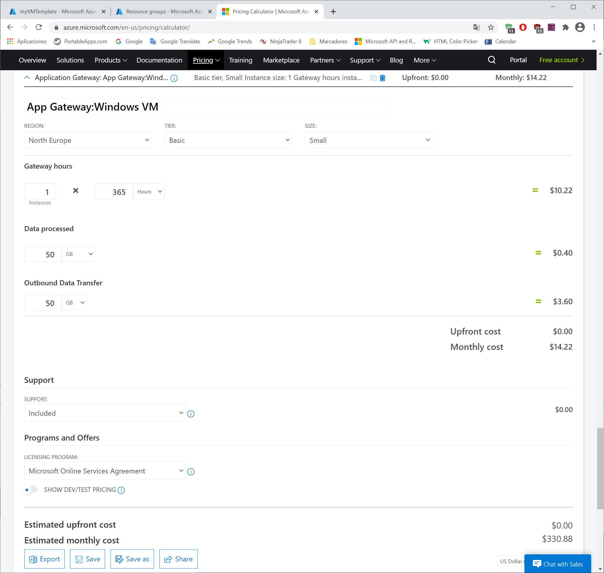
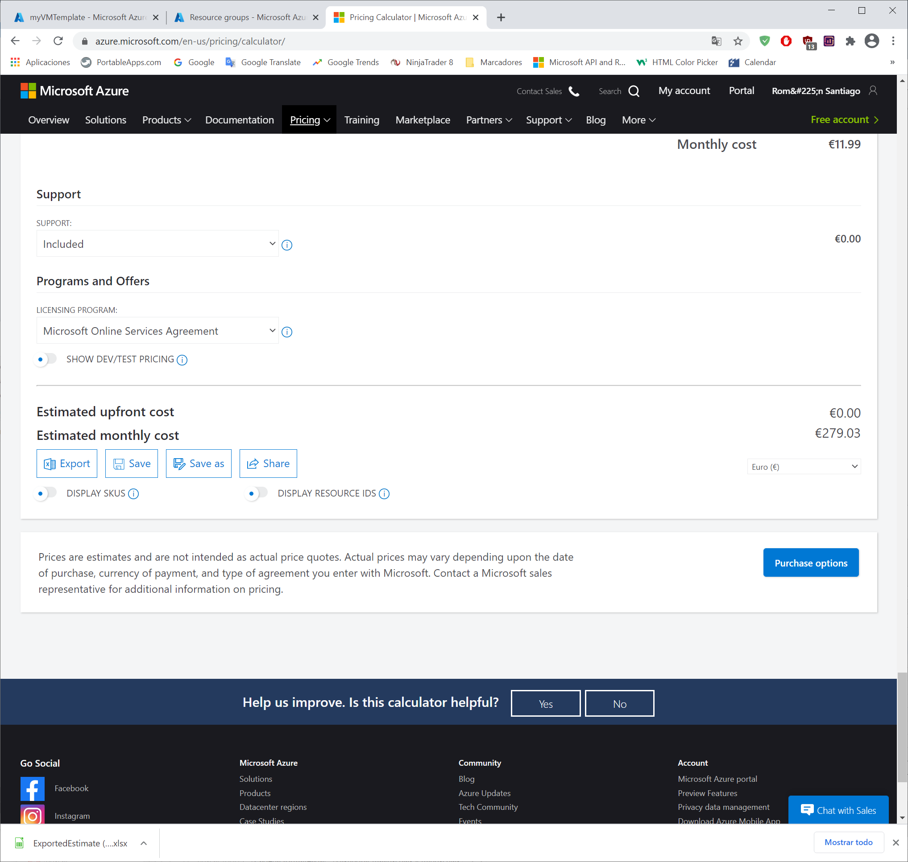

---
wts:
    title: '19 - Use the Azure Pricing Calculator (10 min)'
    module: 'Module 06: Describe Azure cost management and service level agreements'
---
# 19 - Use the Pricing Calculator

